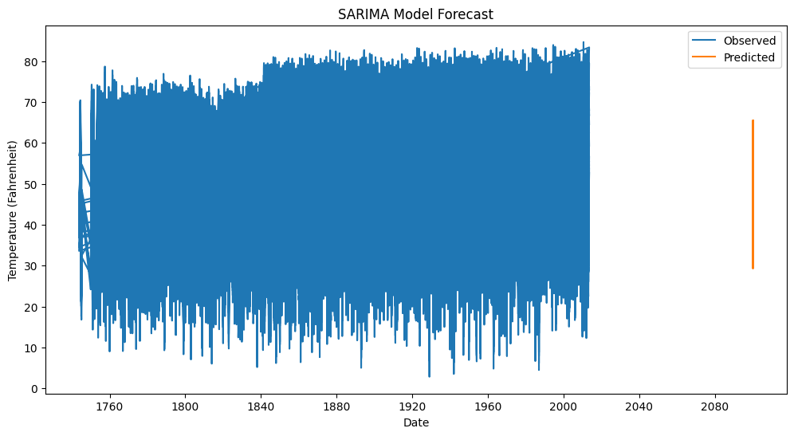

# Exp.no: 10   IMPLEMENTATION OF SARIMA MODEL
### Date: 

### AIM:
To implement SARIMA model using python.
### ALGORITHM:
1. Explore the dataset
2. Check for stationarity of time series
3. Determine SARIMA models parameters p, q
4. Fit the SARIMA model
5. Make time series predictions and Auto-fit the SARIMA model
6. Evaluate model predictions
### PROGRAM:
```py
import pandas as pd
import numpy as np
import matplotlib.pyplot as plt
from statsmodels.tsa.statespace.sarimax import SARIMAX
from statsmodels.graphics.tsaplots import plot_acf, plot_pacf
from statsmodels.tsa.stattools import adfuller
```
```py

df = pd.read_csv("temperature.csv")

df['Date'] = pd.to_datetime(df[['month', 'day', 'year']])
df.set_index('Date', inplace=True)
df.dropna(subset=['AverageTemperatureFahr'], inplace=True)
ts = df['AverageTemperatureFahr']
```
```py

ts.plot(figsize=(12, 6))
plt.title('Average Temperature Over Time')
plt.xlabel('Date')
plt.ylabel('Temperature (Fahrenheit)')
plt.show()
```
```py
def test_stationarity(timeseries):
    print('Results of Dickey-Fuller Test:')
    dftest = adfuller(timeseries, autolag='AIC')
    dfoutput = pd.Series(dftest[0:4], index=['Test Statistic', 'p-value', '#Lags Used', 'Number of Observations Used'])
    for key, value in dftest[4].items():
        dfoutput['Critical Value (%s)' % key] = value
    print(dfoutput)

test_stationarity(ts)
```
```py

plot_acf(ts, lags=20)
plt.title('ACF')
plt.show()

plot_pacf(ts, lags=20)
plt.title('PACF')
plt.show()

order = (1, 1, 1)
seasonal_order = (1, 1, 1, 12) 
model = SARIMAX(ts, order=order, seasonal_order=seasonal_order)
results = model.fit()
```
```py

pred_start = len(ts)
pred_end = pred_start + 24  # 2 years ahead
predictions = results.predict(start=pred_start, end=pred_end, dynamic=False)

plt.figure(figsize=(12, 6))
plt.plot(ts, label='Observed')
plt.plot(predictions, label='Predicted')
plt.title('SARIMA Model Forecast')
plt.xlabel('Date')
plt.ylabel('Temperature (Fahrenheit)')
plt.legend()
plt.show()

```
### OUTPUT:



### RESULT:
Thus the program run successfully based on the SARIMA model.

